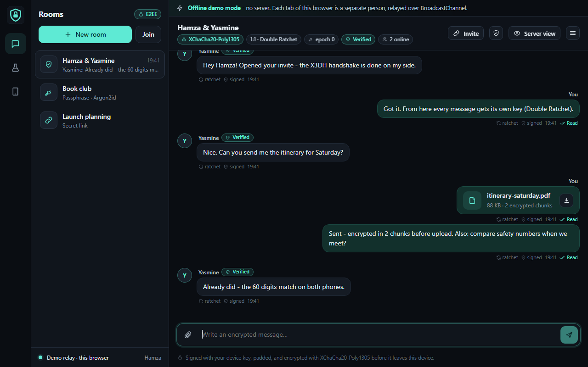
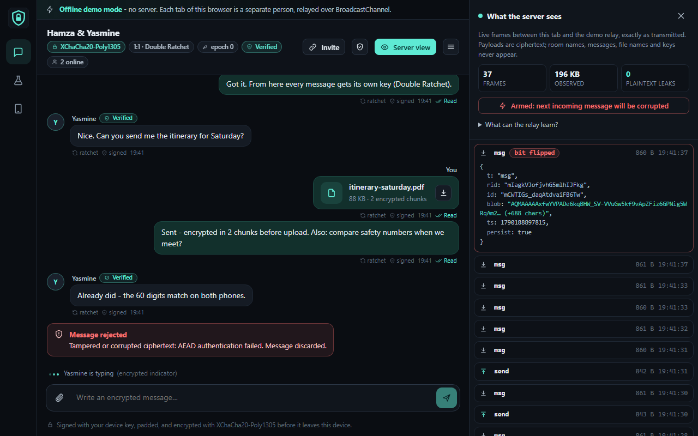
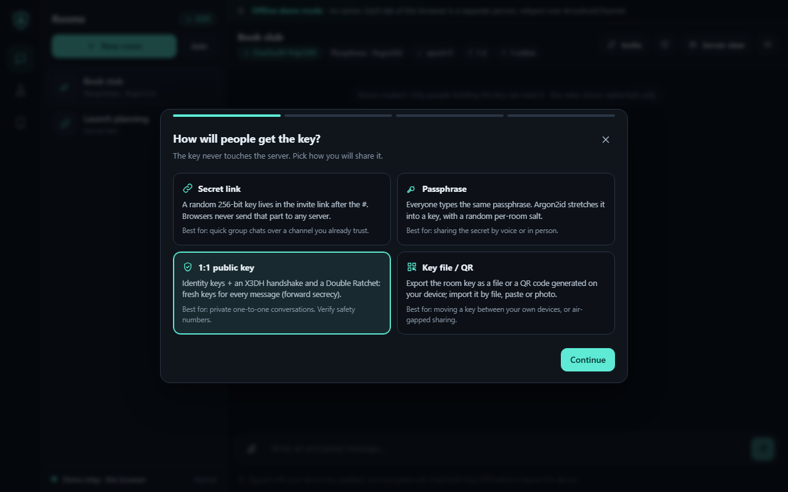
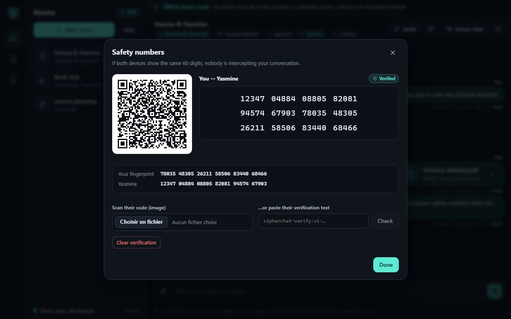
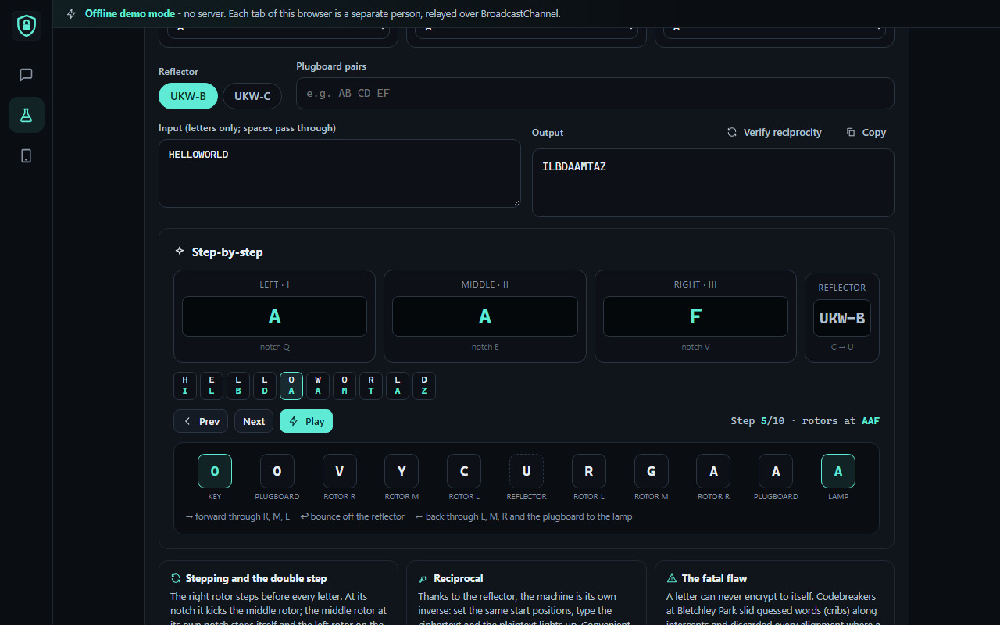
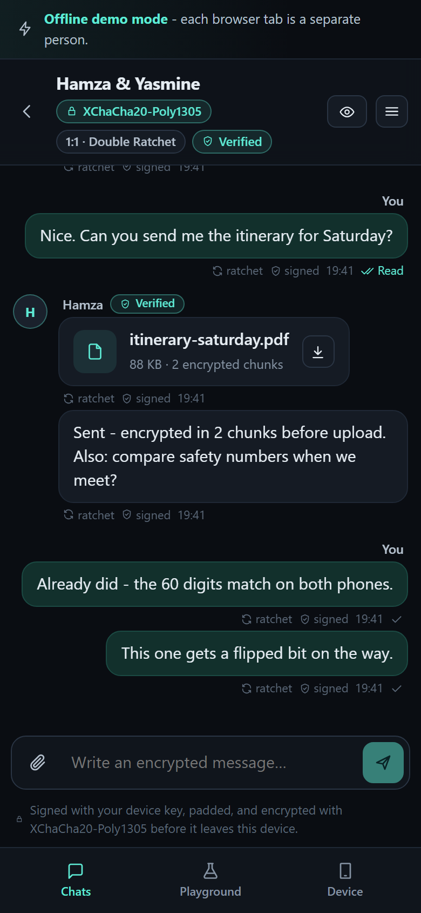
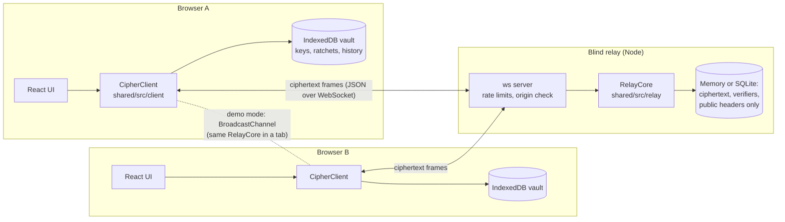

# CipherChat

**End-to-end encrypted real-time chat with a relay server that can't read it.**

Messages, room names and files are encrypted in the browser. The Node relay only ever sees
ciphertext and still gates who can join, without learning the key. A built-in
**"What the server sees"** panel shows every frame live, and a one-click "malicious relay"
switch shows how the client catches tampered data.

[](https://github.com/naniiic137/cipher-chat/actions/workflows/ci.yml)
&nbsp;**Live demo (offline mode):** https://naniiic137.github.io/cipher-chat/ (open it in two tabs and chat with yourself)

> Educational portfolio project, **not audited**. Read [SECURITY.md](SECURITY.md) for the
> threat model and honest limitations before trusting it with anything important.



| What the server sees (tamper demo) | Room creation wizard |
|---|---|
|  |  |
| **Safety numbers + QR verification** | **Enigma playground (NOT secure, educational)** |
|  |  |

<p align="center"></p>

---

## Features

**Four ways to share a room key** (chosen per room)
- **Secret link:** a random 256-bit key lives in the URL fragment (`#…&k=…`), which browsers never send to servers. The app scrubs it from the address bar after reading it.
- **Passphrase:** Argon2id (64 MiB, t=3, WebAssembly) or PBKDF2-SHA-256 (600k iterations) with a random per-room salt, a strength meter and a 125-bit generator. Clients refuse KDF parameters a relay tries to downgrade.
- **1:1 public key:** per-device Ed25519 and X25519 identities, an X3DH-style handshake, and a Double Ratchet "lite" (forward secrecy + post-compromise recovery).
- **Key file / QR:** export a key as JSON or as a QR code generated locally. Import by paste, file or QR photo (decoded locally with jsQR).

**Cryptography**
- Per-room cipher suite: **AES-256-GCM** (Web Crypto), **ChaCha20-Poly1305**, **XChaCha20-Poly1305** (`@noble/ciphers`). The choice sits in an authenticated header.
- HKDF key separation: message key, header key, file key, and a membership key.
- **Every message is Ed25519-signed inside the ciphertext.** Forged or tampered messages are rejected and flagged in red.
- **Membership proof without revealing the key:** the relay stores only an Ed25519 *verifier* and checks a signature over a single-use nonce.
- Replay protection (per-sender counters + sliding window), length-hiding padding buckets, random 96/192-bit nonces.

**Product**
- Key rotation with epochs. In-band sharing, or out-of-band **eviction** (the relay forces everyone to re-prove membership).
- Disappearing messages: the deadline is signed, clients delete, and the relay purges ciphertext.
- Encrypted file and image sharing (64 KiB chunks, 5 MB limit, integrity-checked).
- Encrypted typing indicators and read receipts.
- Safety numbers (60 digits) plus QR verification, and warnings when a contact's key changes.
- Local vault in IndexedDB, optionally encrypted with a device passphrase. **Wipe device** button.
- **Offline demo mode:** with no server, one tab becomes the relay (Web Locks) and tabs talk over BroadcastChannel, using the *same* relay code as the Node server.
- Classic ciphers playground (Caesar, Vigenère, XOR, Atbash, a 3-rotor **Enigma** with step-by-step signal path), clearly labelled **NOT SECURE**.
- Responsive down to 390px, keyboard-accessible dialogs, dark theme with one accent colour, and a strict CSP in production (no CDNs, no third-party requests).

**Relay server**
- Node + `ws`. Strict frame schema, size caps, per-connection and per-IP rate limits, origin allow-list, room TTL, health endpoint.
- In-memory store or optional **SQLite (`node:sqlite`) persistence of ciphertext only**.
- Structured JSON logs that never contain payloads, headers, verifiers or room ids.

## Architecture



`shared/` holds everything security-relevant: the protocol types, crypto core, relay logic and
the client session engine. The UI, the Node server and the tests all import the same code, so
the tests exercise exactly what ships.

<details>
<summary>Message envelope and key hierarchy (summary)</summary>

```
RK (room secret, per epoch) --HKDF--> enc | meta | file | auth -> Ed25519 verifier (relay stores this)

blob = version | suite | epoch | nonce | AEAD_enc( pad( senderPub | Ed25519 sig | body ),
                                                aad = rid | msgId | version | suite | epoch | persist )
```
See [SECURITY.md](SECURITY.md) for diagrams of the membership proof, X3DH and the ratchet.
</details>

## Quick start

Requires **Node 22.12+**.

```bash
npm install
npm run dev          # relay on :3401 + client on :3402
```

Open http://localhost:3402 in **two different browser profiles** (for example a normal and a
private window). With a real relay, each profile is one person, and only one tab per profile is
active at a time. Create a room, copy the invite, open it in the other profile, and turn on
**Server view**.

| Script | What it does |
|---|---|
| `npm run dev` | Relay (tsx watch) + Vite dev server |
| `npm test` | All 257 tests (Vitest) |
| `npm run typecheck` | Strict `tsc` for `shared`, `server`, `client` |
| `npm run build` | Bundles the server (`server/dist/server.js`) and the client (`client/dist`) |
| `npm run build:demo` | Client in offline demo mode with base `/cipher-chat/` (GitHub Pages) |
| `npm start` | Runs the built relay |

### Offline demo mode

When the client is built without a relay URL (as on GitHub Pages), it runs entirely in the
browser. Each **tab** is a separate person with its own keys. One tab hosts the relay
(the same `RelayCore` as the server), and the others reach it over BroadcastChannel. Open the
page in two tabs, create a room in one, and paste the invite into the other.

### Running the relay for real

```bash
npm run build
PORT=3401 ALLOWED_ORIGINS=https://your-site.example SQLITE_PATH=./relay.sqlite npm start
# client pointing at it:
VITE_RELAY_URL=wss://relay.your-site.example/ws npm run build -w client
```

| Variable | Default | Meaning |
|---|---|---|
| `PORT` / `HOST` | `3401` / `0.0.0.0` | Listen address (WebSocket path `/ws`, health at `/health`) |
| `ALLOWED_ORIGINS` | *(empty = any, dev only)* | Comma-separated origins allowed to open WebSockets |
| `SQLITE_PATH` | *(unset = memory)* | Persist ciphertext with `node:sqlite` |
| `ROOM_TTL_HOURS` | `168` | Idle rooms are deleted after this long |
| `TRUST_PROXY` | `false` | Use `X-Forwarded-For` for per-IP limits behind a proxy |
| `RATE_CONN_FPS`, `RATE_IP_FPS`, `RATE_MAX_CONNS_PER_IP`, … | see `server/src/config.ts` | Token-bucket limits |

Put the relay behind TLS (`wss://`) in production.

## Tests

`npm test` runs **257 tests in 13 files** (about 20 s):

| Area | What is checked |
|---|---|
| Published vectors | RFC 5869 HKDF, RFC 7748 X25519, RFC 8032 Ed25519, RFC 8439 ChaCha20-Poly1305, RFC 7914 PBKDF2, RFC 9106 Argon2id (+ WebAssembly vs reference cross-check) |
| AEAD suites | Round trips; wrong key, flipped bits, AAD and nonce changes rejected; 2,000-encryption nonce uniqueness |
| Envelopes | Signer identity, AAD binding of room/message id/persist flag, forged signatures, suite mismatch, unknown epochs, padding buckets |
| Keys | HKDF separation, Argon2id/PBKDF2 determinism, **KDF downgrade refusal**, membership proofs, rekey authorisation, replay window |
| Ratchet | X3DH agreement, bad bundle signature, out-of-order delivery, **forward secrecy**, **post-compromise recovery**, tamper resistance |
| Files, invites, protocol, relay | Chunk tampering and reordering, invite and key-file parsing, schema validation, quotas, TTL sweeps, log hygiene |
| End to end | Every suite × key mode, rotation (in-band and eviction), disappearing messages, receipts, a third party unable to read a 1:1 room |
| **Blind-relay integration** | Real WebSocket server + SQLite. Asserts that no room name, message, file name or content, passphrase, display name or key appears in any frame, the store, the **SQLite file on disk**, or the logs (UTF-8, base64, base64url and hex) |

CI (`.github/workflows/ci.yml`) runs install, typecheck, tests and both builds on every push.
`pages.yml` deploys the demo build to GitHub Pages.

## Project structure

```
cipher-chat/
├─ shared/                 # used by client, server and tests
│  ├─ src/
│  │  ├─ suites.ts         # AES-GCM / ChaCha20 / XChaCha20 AEAD
│  │  ├─ kdf.ts            # HKDF key hierarchy, Argon2id, PBKDF2, strength meter
│  │  ├─ identity.ts       # Ed25519/X25519 identities, safety numbers
│  │  ├─ envelope.ts       # sign-then-encrypt message envelope
│  │  ├─ membership.ts     # zero-knowledge-of-key membership proof, rekey auth
│  │  ├─ x3dh.ts, ratchet.ts
│  │  ├─ files.ts, padding.ts, replay.ts, header.ts, keyfile.ts, protocol.ts
│  │  ├─ relay/            # RelayCore + MemoryStore (server AND demo mode)
│  │  ├─ client/           # CipherClient session engine + WebSocket transport
│  │  └─ classic/          # Caesar, Vigenère, XOR, Atbash, Enigma (NOT secure)
│  └─ test/                # unit + end-to-end tests
├─ server/                 # Node relay: ws, rate limits, SQLite store, logger
│  └─ test/                # blind-relay integration test + unit tests
├─ client/                 # React 18 + Vite UI
│  └─ src/components/      # ChatView, Inspector, RoomWizard, SafetyDialog, Playground…
├─ docs/screenshots/
├─ SECURITY.md             # threat model, crypto design, limitations, disclosure
└─ .github/workflows/      # CI + GitHub Pages
```

## Tech stack

TypeScript (strict) · React 18 · Vite · Node 22 · `ws` · `node:sqlite` · Web Crypto ·
`@noble/curves`, `@noble/ciphers`, `@noble/hashes` · `hash-wasm` (Argon2id) · `qrcode` / `jsQR` ·
Vitest · GitHub Actions / Pages

## Limitations (short version)

Not audited. Metadata (IP, timing, room size, size buckets) is visible to the relay. Whoever
serves the JavaScript can change it. Group rooms have no forward secrecy within an epoch. There
is no multi-device support and no deniability (messages are signed). Passphrase rooms can be
attacked offline by a malicious relay. Details in [SECURITY.md](SECURITY.md#4-known-limitations).

## License

© 2026 Hamza Ben Ismail. All rights reserved.
