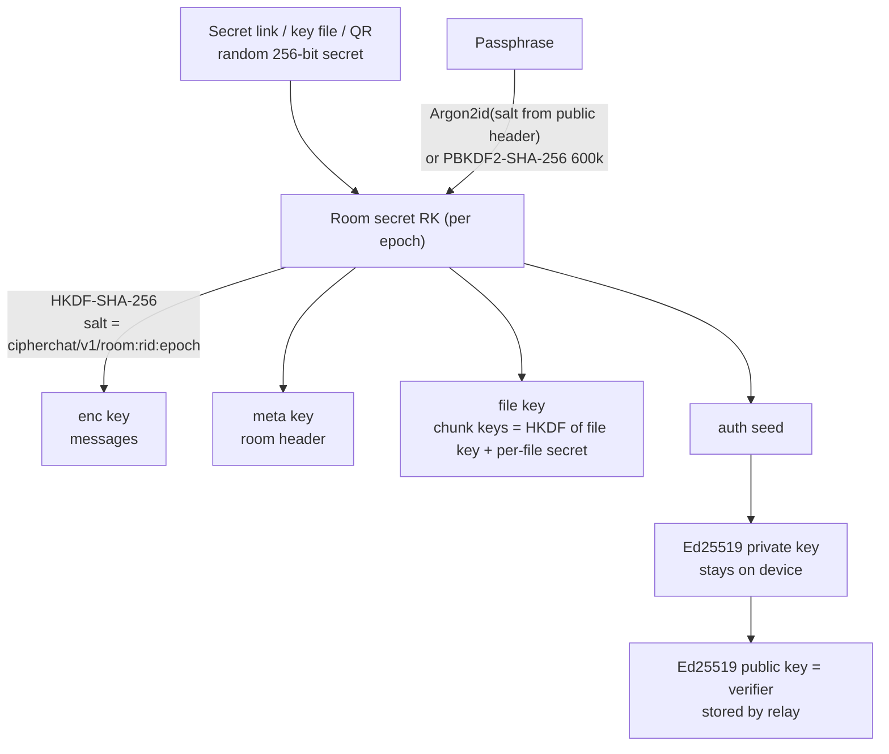
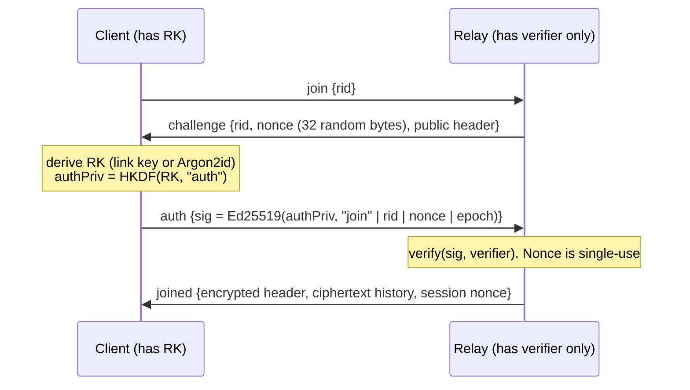

# Security

> **Status: educational portfolio project. It has not been audited.** The design uses
> well-reviewed primitives and libraries and is covered by 257 automated tests, but that is
> not the same as a professional review. **Do not use CipherChat for life-critical secrets.**
> For that, use Signal.

This document describes what CipherChat protects, what it does not, how the cryptography
fits together, and where it deliberately simplifies established protocols.

- [1. Threat model](#1-threat-model)
- [2. Cryptographic design](#2-cryptographic-design)
- [3. Simplifications compared with Signal](#3-simplifications-compared-with-signal)
- [4. Known limitations](#4-known-limitations)
- [5. How the claims are tested](#5-how-the-claims-are-tested)
- [6. Reporting a vulnerability](#6-reporting-a-vulnerability)

---

## 1. Threat model

### Assets

| Asset | Protected? | How |
|---|---|---|
| Message text | Yes | AEAD with a per-room key (or a per-message Double Ratchet key in 1:1 rooms) |
| Room name, key mode, disappearing timer | Yes | Encrypted room header (`header.box`) |
| File names, types and contents | Yes | Encrypted manifest message plus chunks encrypted client-side |
| Who sent a given message | Yes, from the relay | The Ed25519 signature and sender key sit **inside** the ciphertext |
| Typing indicators, read receipts | Yes, content | Encrypted and signed like messages |
| Room keys, identity private keys | Yes | Never leave the device. Optionally encrypted at rest with a device passphrase |

### Adversaries

| Adversary | Can | Cannot |
|---|---|---|
| **Passive network observer** (TLS assumed for real deployments) | See that you talk to a relay, and when | Read anything inside TLS |
| **Honest-but-curious relay operator** | See all metadata (below), store ciphertext, run offline guesses against passphrase rooms (see 4.3) | Read messages, room names or files; learn keys; tell which member sent a message |
| **Malicious relay** | Drop, delay, reorder or replay frames; lie about room size; refuse service; **serve modified JavaScript** (see 4.1) | Forge or alter messages (AEAD + signatures), replay old messages undetected (counters), swap the cipher suite or weaken KDF parameters (AAD binding + client-side bounds), let a non-key-holder join (membership proof) |
| **Malicious room member** (has the room key) | Read the room (that's what a key is for), post under their *own* identity, keep old keys | Impersonate another member (per-device Ed25519 signatures), replay someone else's signed message under a new id, read a 1:1 ratchet conversation they are not part of |
| **Stolen or compromised device** | Everything that device could read, unless the vault is locked with a device passphrase | Read 1:1 messages whose ratchet keys were already deleted (forward secrecy) |

### Metadata that is **not** protected

- IP addresses and connection times (use Tor or a VPN if that matters).
- Which random room ids a connection joins, and therefore which connections share a room.
- Room size (`presence` counts), message timing and frequency.
- Message size **buckets** (padding hides exact lengths, not size classes). File sizes are
  visible to within one 64 KiB chunk.
- Whether a frame is persistent or ephemeral (`persist` flag), and disappearing-message deadlines (`exp`).
- The cipher suite, key epoch and passphrase-KDF parameters (public header).

---

## 2. Cryptographic design

### 2.1 Primitives and libraries

| Purpose | Primitive | Implementation |
|---|---|---|
| Message AEAD (per room) | AES-256-GCM, ChaCha20-Poly1305, XChaCha20-Poly1305 | Web Crypto; `@noble/ciphers` |
| Signatures | Ed25519 | `@noble/curves` |
| Key agreement | X25519 | `@noble/curves` |
| Key derivation | HKDF-SHA-256, HMAC-SHA-256 | `@noble/hashes` |
| Passphrase stretching | Argon2id (64 MiB, t=3, p=1), fallback PBKDF2-SHA-256 (600,000 iterations) | `hash-wasm` (WebAssembly); Web Crypto |
| Randomness | `crypto.getRandomValues` | platform CSPRNG |
| QR codes | encoding / decoding done locally | `qrcode`, `jsQR` (no network) |

No primitive is home-made. The classic ciphers in the playground (Caesar, Vigenère, XOR,
Atbash, Enigma) are **never** used for chat.

### 2.2 Key hierarchy



Every purpose gets its own HKDF output (key separation). The relay only ever holds the
**verifier** (a public key), so learning it reveals nothing about the other keys.

### 2.3 Membership proof without revealing the key

A plain `HMAC(authKey, nonce)` challenge would require the relay to *know* `authKey`.
Instead the auth sub-key seeds an Ed25519 key pair:



- The relay can gate rooms without learning any key material.
- A leaked relay database only contains public keys, so it cannot be used to join.
- Proofs cannot be replayed: they bind a fresh nonce, the room id and the key epoch.

### 2.4 Room header

`PublicHeader = {v, suite, epoch, kdf?}` must be public (a joiner needs the KDF salt before
having the key). It is used as **AEAD associated data** for the encrypted part
(`name, mode, ttl, createdBy, prekey bundle`), so a relay that swaps the cipher suite or
weakens the KDF parameters makes decryption fail. Clients also refuse KDF parameters outside
fixed bounds (Argon2id m ≥ 19 MiB, t ≥ 2; PBKDF2 ≥ 600k iterations; salt ≥ 16 bytes) *before*
deriving anything. Otherwise a malicious relay could lower the cost of offline guessing
(downgrade protection).

### 2.5 Message envelope (sign-then-encrypt, padded)

```
blob = version(1) | suite(1) | epoch(4) | nonce(12 or 24) | AEAD_enc(
          pad( sender Ed25519 pub (32) | signature (64) | body JSON ),
          aad = "cipherchat/v1/frame" | rid | msgId | version | suite | epoch | persist )

signature = Ed25519(device key, "cipherchat/v1/msg" | rid | msgId | epoch | body)
body      = { k: kind, c: per-sender counter, ts, n: display name, x: X25519 identity key, exp?, ...content }
```

- **Signed inside the ciphertext.** The relay cannot tell which member sent a message.
  Binding `rid`, `msgId` and `epoch` into the signature stops a member from re-posting someone
  else's signed body in another room or under another id.
- **AAD** binds the routing fields. The relay cannot move a frame to another room, change its
  id, or reclassify an ephemeral frame as persistent.
- **Padding** (ISO/IEC 7816-4) up to buckets of 512 B, 1 KiB, 2 KiB … 64 KiB, then multiples of
  64 KiB. File chunks are always exactly 64 KiB of padded plaintext.
- **Nonces** are random from the CSPRNG: 96-bit for AES-GCM and ChaCha20-Poly1305, 192-bit for
  XChaCha20-Poly1305. A test checks thousands of encryptions for uniqueness. Per NIST SP 800-38D,
  random 96-bit nonces should stay below 2³² messages per key. Rooms are nowhere near that, and
  key rotation starts a fresh key.
- **Replay protection.** Every body carries a per-sender counter. Receivers keep the highest
  counter per sender plus a 512-entry sliding window, and reject duplicates or counters that
  are too old. Because this state is persisted, a relay re-delivering a frame the client has
  already deleted (for example an expired message) is detected and flagged. Message ids
  deduplicate honest re-deliveries silently.
- **Rejections are visible.** Anything that fails AEAD, signature, suite or replay checks is
  discarded and shown as a red "Message rejected" card, never silently accepted.

### 2.6 1:1 rooms: X3DH-style handshake + Double Ratchet "lite"

```mermaid
sequenceDiagram
  participant B as Bob (room creator)
  participant R as Relay
  participant A as Alice (opens invite)
  Note over B: prekey bundle = {IK_ed, IK_x, SPK, sig_ed(IK_x | SPK)}<br/>stored in the ENCRYPTED room header
  A->>R: join / auth (room key only gates the relay)
  R->>A: encrypted header, which contains Bob's bundle
  Note over A: verify SPK signature<br/>DH1 = DH(IK_A, SPK_B), DH2 = DH(EK_A, IK_B), DH3 = DH(EK_A, SPK_B)<br/>SK = HKDF(0xFF*32 | DH1 | DH2 | DH3)
  A->>R: msg {k:"dr", init:{IK_A, EK_A}, ratchet message}
  R->>B: (same ciphertext)
  Note over B: same SK; the session binds to Alice's key<br/>(TOFU, then compare safety numbers)
  B-->>A: every reply advances the DH ratchet
```

- **Symmetric ratchet.** Each message key is `HMAC(chainKey, 0x01)` and the chain moves on with
  `HMAC(chainKey, 0x02)`. Used keys are deleted, so a stolen *current* state cannot decrypt
  *earlier* messages (**forward secrecy**, tested).
- **DH ratchet.** When the conversation changes direction, the replying side generates a new
  X25519 key pair and mixes a fresh DH output into the root key with HKDF. After a full round
  trip, a stolen old state no longer decrypts new messages (**post-compromise recovery**,
  tested with a passive attacker who keeps following the conversation).
- Out-of-order delivery is handled with a bounded skipped-key cache (≤ 64 per chain, ≤ 256 total).
- All ratchet operations are functional (they return a *new* state only on success), so a
  forged or corrupted message cannot desynchronise a session.
- The ratchet message itself travels inside the normal room envelope. Ratchet headers (DH
  public keys, counters) are therefore hidden from the relay, and every room's frames look alike.
- Files in 1:1 rooms: the manifest carrying the per-file secret goes through the ratchet.

### 2.7 Identity, safety numbers and key-change warnings

Each device generates an Ed25519 signing key and an X25519 key-agreement key. A fingerprint
is 30 digits from 1,024 iterations of SHA-512 over both public keys. A **safety number** is the
two fingerprints sorted and concatenated (60 digits, the same on both devices). It can be
compared visually or through a locally generated QR code (`cipherchat-verify:v1:…`), which is
checked against the peer's *current* keys. If a known display name shows up with a different
key, the room shows a warning. The warning becomes red if the old key had been verified.

### 2.8 Key rotation and eviction

Rotation creates epoch `e+1` with a fresh secret (or a new passphrase and new salt) and a new
verifier. The relay accepts the rotation only when it is signed by the **current** epoch's auth
key and bound to the connection's session nonce. It then **de-authorises every other
connection**, which must re-prove membership with the new key.

- *In-band* distribution sends the new key encrypted and signed under the old key. This is
  convenient, and it limits the damage if a single epoch key leaks later.
- *Out-of-band* (the "Evict" option) sends nothing. Only people who receive the new invite
  can rejoin. This is the way to remove a member.
- Old epoch keys stay on members' devices so history remains readable. New members cannot read
  epochs before their key ("encrypted with an earlier key" placeholders).

### 2.9 Disappearing messages

The deadline `exp` sits in the **signed** body, so clients enforce it even if the relay keeps
the data. The same value is sent in the clear so the relay can purge ciphertext
(`purgeExpired`, run periodically). With SQLite persistence, `secure_delete` is enabled so
purged rows are overwritten. No one can guarantee that a recipient did not screenshot or copy
a message.

### 2.10 Local storage

All state (identity, room keys, ratchet sessions, history) is one IndexedDB record. With a
device passphrase it is stored as `AES-256-GCM(Argon2id(passphrase, salt), vault)`, and the
derived key lives in memory only while the app is unlocked. "Wipe device" deletes the database.
In server mode only one tab may use a profile at a time (Web Locks), which keeps counters and
ratchet state consistent. In demo mode each tab is its own profile.

### 2.11 The relay

- Validates every frame against a strict schema (`parseClientFrame`) and caps frame size
  (200 KB), blob size, files per room (40), stored messages per room (500), members (64)
  and rooms per connection (32).
- Token-bucket rate limits per connection and per IP (frames/s and bytes/s), a cap on
  concurrent connections per IP, and socket closure on repeated abuse.
- Origin allow-list on the WebSocket upgrade (`ALLOWED_ORIGINS`), and no CORS wildcard.
- Structured JSON logs never contain payloads, headers, verifiers or room ids. Rooms appear
  only as a short one-way hash (`roomTag`), and the logger strips forbidden fields defensively.
- In-memory store by default, or optional SQLite (`node:sqlite`) that stores **ciphertext only**.
  Idle rooms expire (default 7 days).

---

## 3. Simplifications compared with Signal

| Signal | CipherChat | Consequence |
|---|---|---|
| One-time prekeys (DH4) on a prekey server | Signed prekey only, delivered in the encrypted room header | Weaker protection of the *first* message if the SPK is later compromised. The initial message can be replayed at the protocol level (the replay counters catch it) |
| Deniable authentication (no signatures on messages) | Every message is Ed25519-signed | **No deniability.** A recipient can prove to others that you signed a message |
| Header encryption as an extension | Ratchet headers are wrapped in the room-key envelope | Hidden from the relay, but not from someone who has the room key |
| Sesame: multi-device, session management | One device, one session per 1:1 room | No multi-device; you cannot read your own 1:1 history on another device |
| Sealed sender, contact discovery, PQXDH / ML-KEM | Not implemented | Metadata exposure as described; no post-quantum protection |
| Sender Keys for groups | Shared symmetric room key plus per-message signatures | Group rooms have **no forward secrecy** within an epoch. Rotation is manual |
| Audited, formally analysed | Not audited | See the status note at the top |

---

## 4. Known limitations

1. **The JavaScript delivery problem.** Whoever serves the web app can serve a modified
   version that steals keys. This is true of every browser-based E2EE app. Mitigations
   here: a strict Content-Security-Policy (no third-party origins, no inline scripts), no CDNs,
   and a static, reproducible build that can be self-hosted. Real protection would need signed
   releases or a native or extension client.
2. **Compromised device or XSS.** Keys live in the page's memory and IndexedDB. Malware or an
   XSS bug on the same origin can read them. The device passphrase only protects data **at rest**.
3. **Passphrase rooms can be attacked offline.** The relay stores the KDF salt and the verifier,
   so an operator can test guesses, each costing one Argon2id evaluation (64 MiB). Use the
   generated 125-bit passphrases, or a link or key file.
4. **Trust on first use.** Keys are accepted the first time they are seen. A man-in-the-middle at
   invite time is detectable only by comparing safety numbers.
5. **Invite links are bearer secrets.** Anyone who sees the link (chat logs, screenshots,
   clipboard managers) can read the room. The fragment is never sent to servers and is removed
   from the address bar once read, but it may remain in browser history.
6. **Group membership is not cryptographically enforced** beyond "has the key". In-band rotation
   does not evict anyone. Out-of-band rotation does.
7. **JavaScript cannot guarantee memory hygiene.** Secrets are zeroed where practical, but garbage
   collection and string immutability mean copies can survive.
8. **Demo mode** keeps its relay state in `localStorage` of your browser and relays between tabs
   of the same browser only. It is a demonstration, not a deployment.
9. **Availability** is not protected: a relay can drop or delay traffic, and IP-based rate
   limits can be evaded with many addresses or can affect users behind shared NAT.

---

## 5. How the claims are tested

`npm test` runs 257 tests (Vitest), including:

- **Published test vectors:** RFC 5869 (HKDF), RFC 7748 (X25519), RFC 8032 (Ed25519),
  RFC 8439 (ChaCha20-Poly1305), RFC 7914 (PBKDF2-SHA-256), RFC 9106 (Argon2id). The WebAssembly
  Argon2id used by the app is cross-checked against an independent implementation.
- **Round trips** for every cipher suite × key mode (link, passphrase with Argon2id or PBKDF2,
  key file, QR, 1:1), plus rejection of wrong keys, flipped bits, edited headers, AAD changes,
  forged signatures, suite mismatches and replays.
- **Nonce uniqueness**, padding buckets, replay windows, KDF downgrade refusal.
- **Ratchet:** forward secrecy, post-compromise recovery, out-of-order delivery, skip limits,
  tamper resistance.
- **Relay logic:** membership proof, single-use challenges, rekey authorisation and
  de-authorisation, quotas, TTL sweeps, schema validation, and log hygiene.
- **Blind-relay integration test:** starts the real WebSocket server with SQLite, runs every
  key mode, file sharing, receipts and rotation, then asserts that no room name, message, file
  name, file content, passphrase, display name or room key appears in **any** frame the server
  received or sent, in its store, in its **SQLite file on disk**, or in its logs. Each secret is
  checked as UTF-8, base64, base64url and hex.

---

## 6. Reporting a vulnerability

Please **do not open a public issue** for security problems.

- Use GitHub's **private vulnerability reporting** on this repository (Security tab →
  "Report a vulnerability").
- Include steps to reproduce, the affected version or commit, and the impact you expect.
- You can expect an acknowledgement within 7 days and a status update within 30 days.
  Fixes are credited in the release notes unless you prefer to remain anonymous.

Good-faith research is welcome: test only against your own local or demo instances, and do not
access other people's data or degrade shared services.
